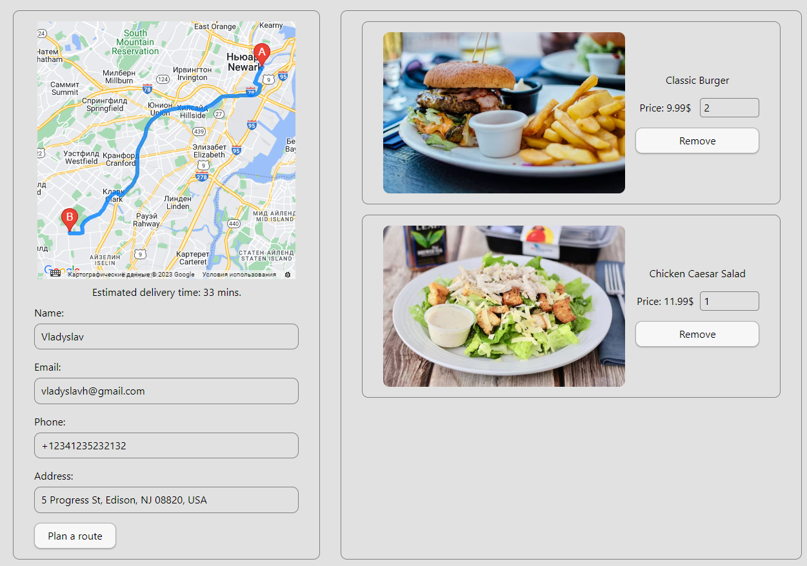

# Delivery App ([Frontend](https://github.com/h0wter/delivery-frontend) and [Backend](https://github.com/h0wter/delivery-backend) )

### Important❗ The backend is placed on render, the server shuts down after inactivity. After a new request, it needs about a minute to resume work.

## Application Description:

Introducing a seamless and convenient food ordering service that revolutionizes
your dining experience. Our innovative platform empowers you to effortlessly
explore a wide range of establishments, browse their delectable offerings, and
easily customize your order to perfection.

With our intuitive interface, you can effortlessly navigate through a diverse
array of options, compare prices, and make informed decisions that satisfy your
cravings. Our service integrates seamlessly with interactive maps, allowing you
to pinpoint the exact location of your desired establishment and even obtain a
detailed route and estimated delivery time, ensuring you're always in control of
your dining experience.

What sets our service apart is the flexibility it offers. Whether you're at home
or on the go, you can conveniently choose a delivery address from the map or
enter your own, making sure your food reaches you wherever you are. Our
cutting-edge technology stack, comprising HTML, CSS, JavaScript, React, Node.js,
MongoDB, and Styled-System, guarantees a smooth and efficient ordering process,
catering to your every need.

## Run instructions:

1. Make sure you have the LTS version of Node.js installed on your computer.
   [Download and install](https://nodejs.org/en/) if necessary.
2. Install the project's basic dependencies with the `npm install` command.
3. Start development mode by running the `npm run dev` command.
4. Go to [http://localhost:3000/](http://localhost:3000/) in your browser. This
   page will automatically reload after saving changes to the project files.

### Shops page

### Cart page

## Authors

[Vladyslav Holik](https://github.com/h0wter) - developer
